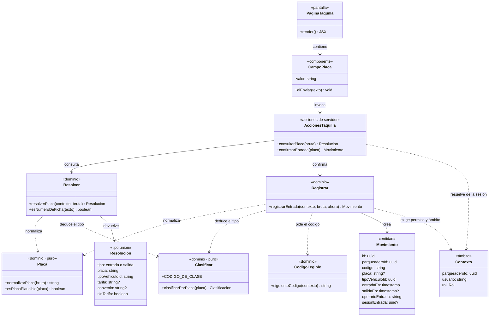

# CU-07 · Diagrama de clases

El sistema está escrito en TypeScript con funciones y tipos, no con clases. El
diagrama representa cada **módulo** como una clase: sus funciones exportadas son
los métodos y sus tipos exportados, los atributos. Es la traducción fiel de lo
que hay en `codigo/`.

## Qué hace cada pieza

| Módulo | Responsabilidad | Por qué está separado |
|---|---|---|
| `campo-placa.tsx` | El único campo de la pantalla | Es el control que el operario usa todo el día; vive aparte para poder probar su comportamiento sin montar la página entera |
| `acciones.ts` | Frontera entre navegador y servidor | Aquí se resuelve la sesión. Nada de lo que llega del cliente decide el establecimiento |
| `resolver.ts` | Decide si es entrada o salida | El operario no elige: el sistema lo deduce de si la placa ya está adentro |
| `registrar.ts` | Escribe el movimiento | Exige el permiso `taquilla.entrada` antes de tocar la base |
| `placa.ts` | Normaliza y valida | Puro: sin base de datos ni reloj. `abc 123` y `ABC-123` son el mismo vehículo |
| `clasificar.ts` | Deduce carro o moto | Puro y aislado a propósito: es una convención colombiana, no una ley, y tiene que poder cambiar sin tocar la taquilla |

## La relación que importa

`Contexto` no es un parámetro más. Lleva el establecimiento resuelto **desde la
sesión**, y la base de datos rechaza cualquier consulta que llegue sin él. Por
eso aparece como dependencia tanto de las acciones como del dominio: es lo que
impide que un establecimiento alcance los datos de otro.
