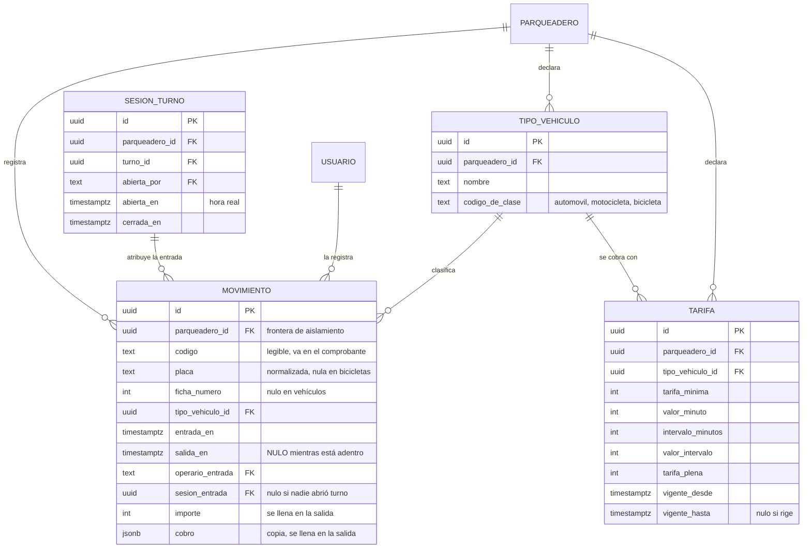

# CU-07 · Modelo de base de datos

Las tablas que este caso de uso toca, con las columnas reales del esquema.

## Cuatro decisiones del esquema que este caso de uso hace visibles

### No hay columna de estado

`MOVIMIENTO` no tiene un campo `estado`. Que el vehículo esté adentro se deduce
de que `salida_en` sea nulo.

Una columna aparte podría contradecir a las fechas, y entonces habría dos
verdades sobre lo mismo y ninguna forma de saber cuál vale.

### La placa se guarda normalizada

Se almacena ya en mayúsculas y sin separadores, nunca como la escribió alguien.
Así `abc 123` y `ABC-123` son el mismo vehículo al comparar.

### Un índice único impide la doble entrada

El requisito «una misma placa no puede estar adentro dos veces» no se comprueba
consultando antes de insertar —entre la consulta y la inserción cabe otra
inserción— sino con un índice único parcial sobre parqueadero y placa,
limitado a las filas con `salida_en` nulo. Lo garantiza el motor, no el orden
de las operaciones.

### `importe` y `cobro` nacen vacíos

Este caso de uso sólo abre el movimiento. Las dos columnas del dinero las llena
CU-08 al cerrarlo, y desde ese momento un disparador impide modificar la fila.

## Aislamiento

Todas estas tablas llevan `parqueadero_id` y tienen activada seguridad a nivel
de fila **forzada**. Una consulta que llegue sin el ámbito fijado no devuelve
cero filas: falla. La diferencia importa, porque cero filas se puede confundir
con «no hay nada» y un fallo no.
