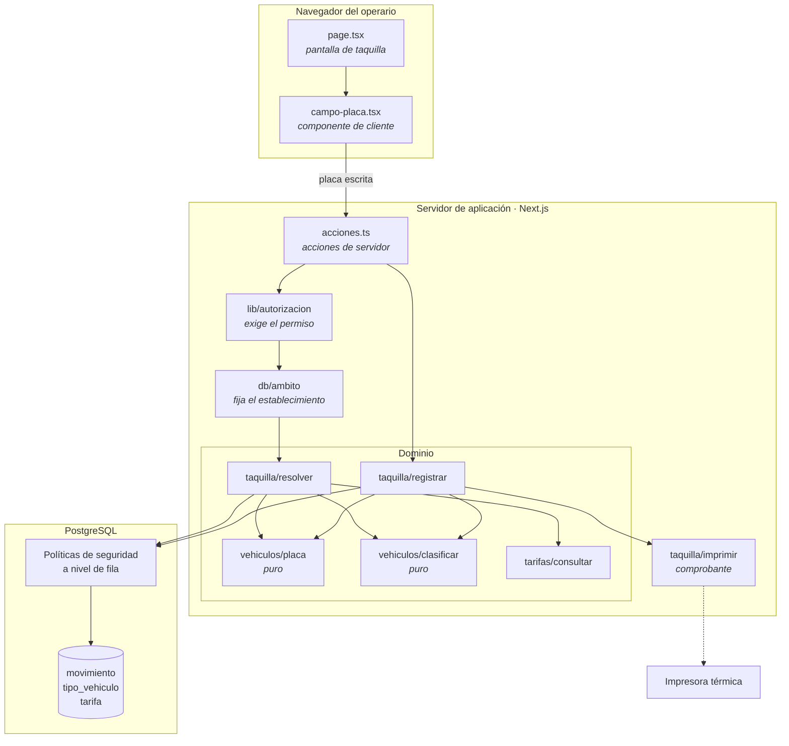

# CU-07 · Diagrama de componentes

## Cómo se leen las capas

| Capa | Qué puede hacer | Qué no |
|---|---|---|
| **Navegador** | Recoger lo que el operario escribe y mostrar el resultado | Decidir el establecimiento, calcular el importe o confiar en cualquier valor propio |
| **Acciones de servidor** | Resolver la sesión, exigir el permiso, fijar el ámbito | Contener reglas de negocio |
| **Dominio** | Todas las reglas: normalizar, clasificar, consultar tarifa, escribir el movimiento | Saber que existe una pantalla |
| **Base de datos** | Rechazar lo que viole el aislamiento o la inmutabilidad | Confiar en que la aplicación ya comprobó |

## Las dos piezas puras

`placa` y `clasificar` no tocan la base de datos ni el reloj. Reciben una cadena
y devuelven un resultado, siempre el mismo. Por eso se pueden probar con
entradas inventadas, sin montar nada, y por eso la regla del último carácter se
puede sustituir sin que ningún otro módulo se entere.

## La impresora, con línea discontinua

La conexión con la impresora se dibuja punteada porque **su fallo no detiene el
caso de uso**. Si no responde, el movimiento queda igualmente registrado y el
comprobante pasa a una lista de pendientes. La fila no se detiene por una
impresora.
