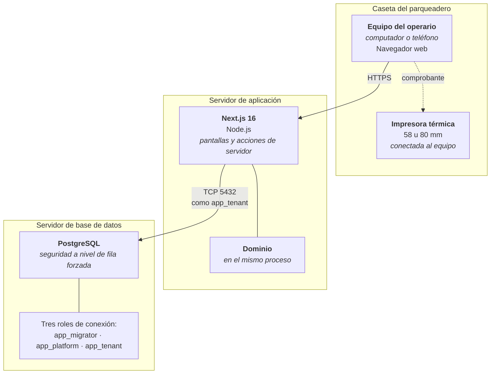

# CU-07 · Diagrama de despliegue

Dónde se ejecuta cada pieza cuando un operario registra una entrada.

## Qué se ejecuta dónde

| Nodo | Qué corre | Por qué ahí |
|---|---|---|
| **Equipo del operario** | Sólo la interfaz | No hay lógica de cobro en el navegador. Nada que llegue de ahí decide qué establecimiento es ni cuánto se paga |
| **Servidor de aplicación** | Pantallas, acciones y dominio, en un mismo proceso | El dominio no es un servicio aparte: llamarlo es una llamada de función, no una petición de red. Una pieza menos que puede fallar |
| **Base de datos** | Datos, políticas de aislamiento y disparadores de inmutabilidad | Las garantías que no pueden depender de que alguien las recuerde viven en el motor |

## Los tres roles de conexión

La aplicación **nunca** se conecta como dueña del esquema. Son tres roles
distintos y este caso de uso usa sólo el último:

| Rol | Para qué | Puede saltarse el aislamiento |
|---|---|---|
| `app_migrator` | Sólo migraciones, nunca la aplicación en marcha | Es dueño del esquema |
| `app_platform` | Autenticación y administración global | Sí, deliberadamente |
| `app_tenant` | **Todo lo demás, incluido este caso de uso** | **No** |

Que `app_tenant` no pueda saltarse el aislamiento es lo que convierte la
separación entre establecimientos en una garantía del motor y no en una promesa
del código.

## La impresora no es un nodo de red

Está conectada al equipo del operario, no al servidor. El servidor genera el
comprobante y lo entrega al navegador, que lo imprime. Por eso su fallo es local
y no interrumpe el registro: el movimiento ya quedó escrito antes de intentar
imprimir.
