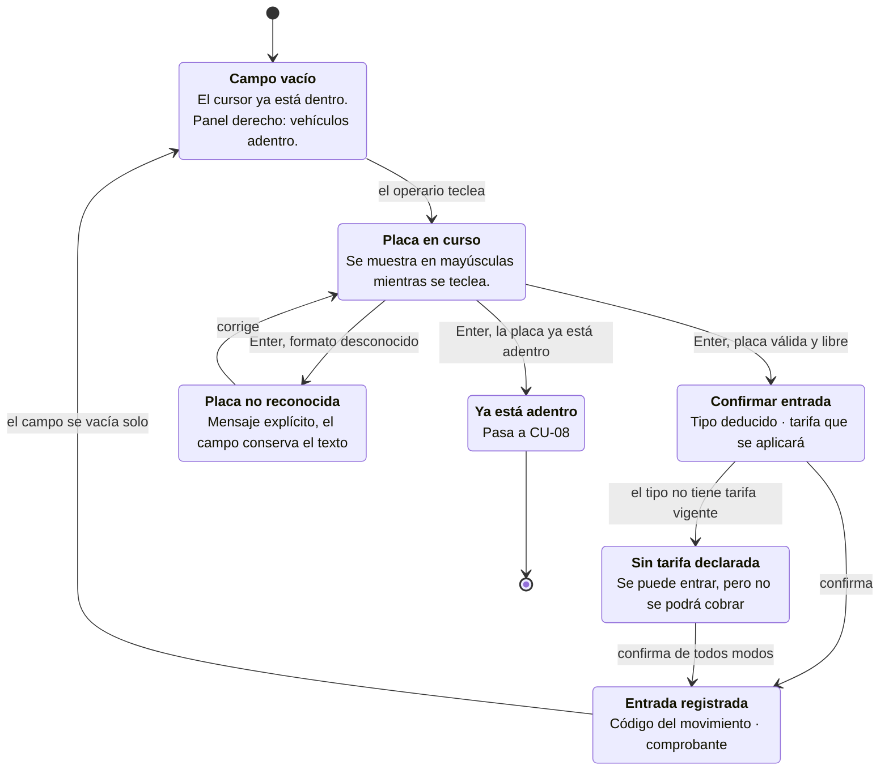

# CU-07 · Diagrama de interfaz

## Los estados de la pantalla



## La pantalla

```
┌────────────────────────────────────────────────────────────────┐
│  PARQUIVO            Taquilla                    Turno: abierto │
├──────────────────────────────────────┬─────────────────────────┤
│                                      │  ADENTRO AHORA          │
│   ┌──────────────────────────────┐   │  ─────────────────────  │
│   │                              │   │   ABC123    2 h 14 min  │
│   │        A B C 1 2 3           │   │   XYZ89D      45 min    │
│   │                              │   │   Ficha 3   1 h 02 min  │
│   └──────────────────────────────┘   │                         │
│      ↑ un solo campo, enorme         │   12 carros             │
│                                      │    4 motos              │
│   Automóvil · $3.000 la hora         │    3 bicicletas         │
│                                      │                         │
│   [ Confirmar entrada ]              │                         │
│                                      │                         │
└──────────────────────────────────────┴─────────────────────────┘
```

## Las cuatro decisiones de interfaz

### Un solo campo

No hay un botón de «entrada» y otro de «salida». Se escribe la placa y el
sistema decide cuál de las dos es, según si ese vehículo ya está adentro.
Quien atiende no elige: escribe y confirma.

### La placa va grande y enmarcada

El campo no es un control de formulario que casualmente es grande. Es la
representación del objeto que el operario está mirando —la placa del carro que
tiene delante— y por eso se parece a una placa: rectángulo enmarcado, alto, con
el texto enorme y centrado.

Así se confirma de un vistazo, de pie y de reojo, que lo escrito coincide con el
metal.

### No se pregunta el tipo de vehículo

La pantalla no tiene selector de carro o moto. El tipo se deduce del último
carácter de la placa y se muestra ya resuelto, junto a la tarifa. Un dato menos
que pedir en cada vehículo, y por tanto un error menos.

### El campo se vacía solo

Al confirmar, el campo queda vacío y con el cursor dentro, listo para el
siguiente. La pantalla está pensada para una fila: lo normal es registrar varios
seguidos sin tocar el ratón.

## Accesibilidad

El ciclo completo se opera **sin ratón**: se escribe la placa, se confirma con
Enter. El contraste de todos los textos se verificó con cálculo de luminancia
—4,5:1 sobre el fondo y 3:1 en los contornos— en los temas claro y oscuro,
porque una caseta se atiende de noche y a veces con una pantalla vieja.
