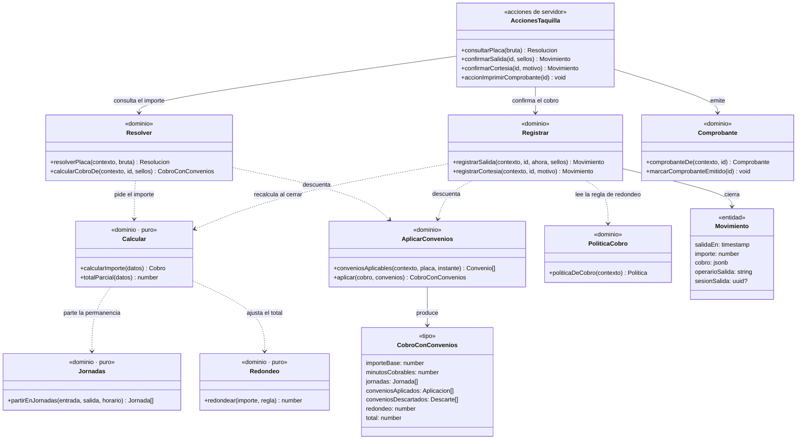

# CU-08 · Diagrama de clases

Cada **módulo** se representa como una clase: sus funciones exportadas son los
métodos y sus tipos exportados, los atributos.

## Qué hace cada pieza

| Módulo | Responsabilidad |
|---|---|
| `calcular.ts` | Dados entrada, salida, tarifa y horario, devuelve el importe **y su desglose** |
| `jornadas.ts` | Parte la permanencia en jornadas tarifarias, para que tres días no se cobren como una tarde |
| `convenios/aplicar.ts` | Decide qué convenios alcanzan a esa placa en ese instante y qué descuenta cada uno |
| `cobro/politica.ts` | Lee la regla de redondeo que declaró el establecimiento |
| `cobro/redondeo.ts` | Aplica esa regla: al peso, a la cincuentena o a la centena |
| `registrar.ts` | Cierra el movimiento y guarda la copia de lo aplicado |

## Las dos propiedades que definen este caso

### El cálculo es una operación pura

`calcularImporte` recibe datos y devuelve un resultado. No consulta la base, no
mira el reloj, no depende de la sesión. Por eso se puede ejercitar con momentos
inventados, sin que exista ningún vehículo ni ningún movimiento, y por eso se
puede confiar en la pieza que decide cuánto paga la gente.

### El resultado no es un número, es un desglose

`calcularImporte` no devuelve el total: devuelve `CobroConConvenios`, que lleva
el importe base, los minutos cobrables, las jornadas, **cada convenio aplicado
con lo que restó**, **los descartados con su motivo** y el redondeo.

Esa estructura es la razón de que el operario pueda responder «por qué pago
esto». Un cálculo que sólo devolviera el total haría imposible la promesa del
producto.
