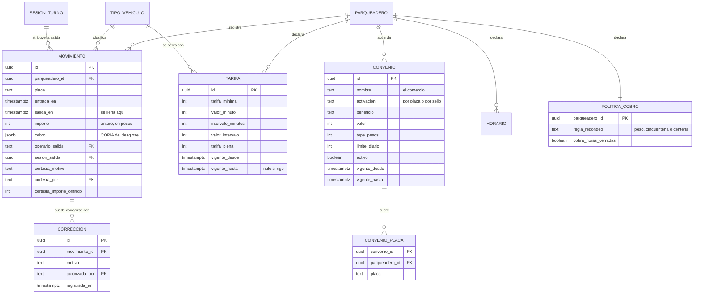

# CU-08 · Modelo de base de datos

## La decisión central: `cobro` es una copia, no una referencia

La columna `cobro` es un documento **embebido**, no una llave foránea a `TARIFA`
ni a `CONVENIO`. Guarda el desglose completo tal como se calculó en ese
instante.

Si fuera una referencia, cambiar una tarifa mañana alteraría lo que se cobró
ayer, y el historial dejaría de poder explicarse. Guardar la copia cuesta
espacio y resuelve el problema para siempre.

| | Con referencia | Con copia |
|---|---|---|
| Cambiar la tarifa hoy | Altera cobros pasados | No los toca |
| Borrar un convenio | Rompe el historial | El historial sigue íntegro |
| Explicar un cobro de hace un año | Imposible si la tarifa cambió | Está todo en la fila |

## El movimiento cerrado es inmutable

En cuanto `salida_en` deja de ser nulo, la fila no se puede modificar ni borrar.
**Eso no se confía al código de la aplicación**: lo impide un disparador
declarado en `blindaje.sql`.

La garantía no puede depender de que quien escriba la próxima consulta se
acuerde de la regla.

Por eso existe `CORRECCION`: si hubo un error, se registra un asiento nuevo que
apunta al original, con quién lo hizo y por qué. El historial crece, nunca se
reescribe.

## Los importes son enteros

Todas las columnas de dinero son `integer`, en pesos colombianos. Nunca punto
flotante.

El punto flotante no representa exactamente los decimales y los errores se
acumulan al sumar. En un producto cuya función principal es cuadrar la caja al
cierre, un peso de diferencia es un fallo.

## La cortesía deja rastro

Cerrar sin cobro no es dejar el importe en cero. Se registran tres cosas
aparte: el motivo escrito, quién lo autorizó y **cuánto se habría cobrado**. Sin
ese último dato no se puede saber cuánto dinero dejó de entrar por cortesías.
