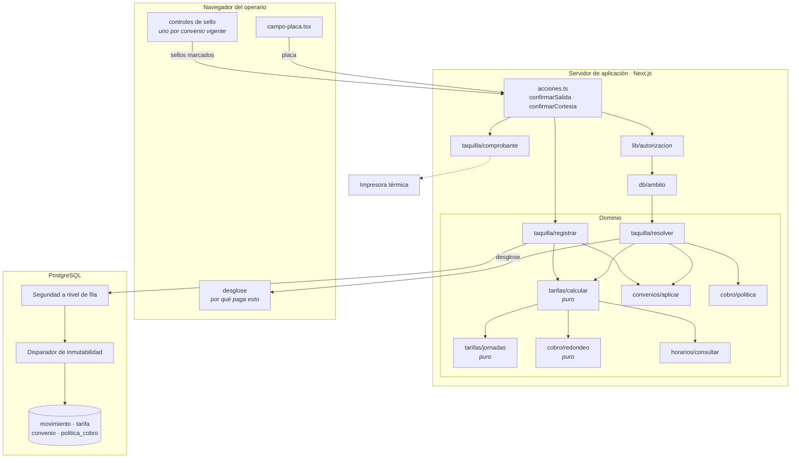

# CU-08 · Diagrama de componentes

## El recorrido de un cobro

1. La placa llega al servidor. Se resuelve la sesión, se exige el permiso
   `taquilla.salida` y se fija el ámbito del establecimiento.
2. `resolver` ve que el vehículo está adentro y pide el cálculo.
3. `calcular` parte la permanencia en jornadas, consulta el horario para saber
   qué tiempo es cobrable, aplica la tarifa y redondea.
4. `convenios/aplicar` descuenta los de activación por placa, y deja listos los
   de sello para que el operario marque el que traiga el cliente.
5. El desglose vuelve a la pantalla. **Todavía no se ha escrito nada.**
6. Si el operario marca un sello, se recalcula y se vuelve al paso 3.
7. Al confirmar, `registrar` recalcula por última vez y cierra el movimiento.

## Por qué se recalcula al cerrar

El importe que se guarda **no es el que viajó a la pantalla**. Se vuelve a
calcular en el servidor en el momento de cerrar, a partir de los sellos
confirmados.

Si se guardara el número que llegó del navegador, cualquiera podría enviar otro.
El desglose que se muestra es informativo; el que cuenta es el que el servidor
produce al escribir.

## Las tres piezas puras

`calcular`, `jornadas` y `redondeo` no tocan la base ni el reloj. Son las que
deciden cuánto paga la gente, y por eso son justamente las que se pueden probar
con datos inventados, sin montar nada.
