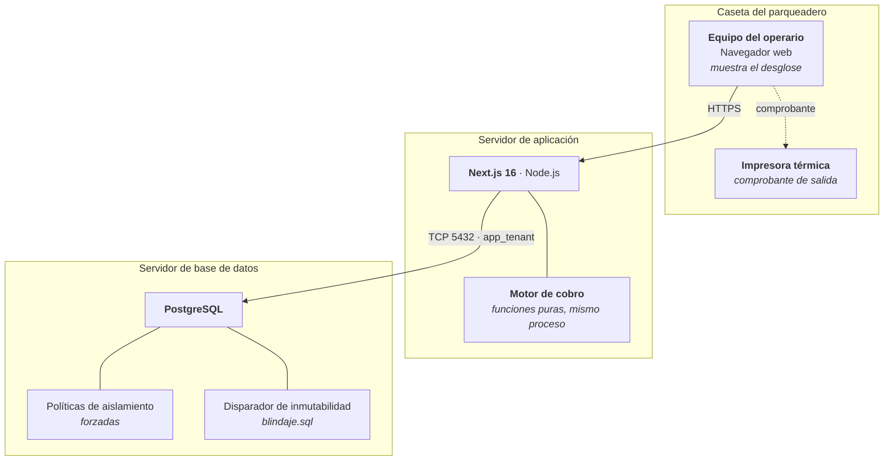

# CU-08 · Diagrama de despliegue

## Dónde se decide el dinero

| Nodo | Papel en el cobro |
|---|---|
| **Equipo del operario** | Muestra el desglose y recoge los sellos marcados. **No calcula nada** |
| **Servidor de aplicación** | Calcula el importe, lo recalcula al cerrar y escribe el movimiento |
| **Base de datos** | Rechaza cualquier intento de modificar un movimiento ya cerrado |

El importe nunca se calcula en el navegador, y el que llega del navegador nunca
se guarda. Es la misma razón por la que un cajero no acepta que el cliente
diga cuánto marcó la registradora.

## Sin servicios externos

Este caso de uso **no sale a la red**. El cálculo no consulta ninguna interfaz
ajena, ningún servicio de tarifas, ningún conversor. Con la salida a internet
cerrada, un parqueadero puede seguir cobrando.

Es deliberado: una caseta con internet intermitente es lo normal, y un cobro que
depende de que haya conexión es un cobro que un día no se puede hacer.

## La única salida hacia afuera

El comprobante, y va hacia la impresora del propio equipo, no hacia la red. Si
falla, el movimiento ya quedó cerrado y cobrado; el comprobante pasa a
pendientes y se reimprime después.
