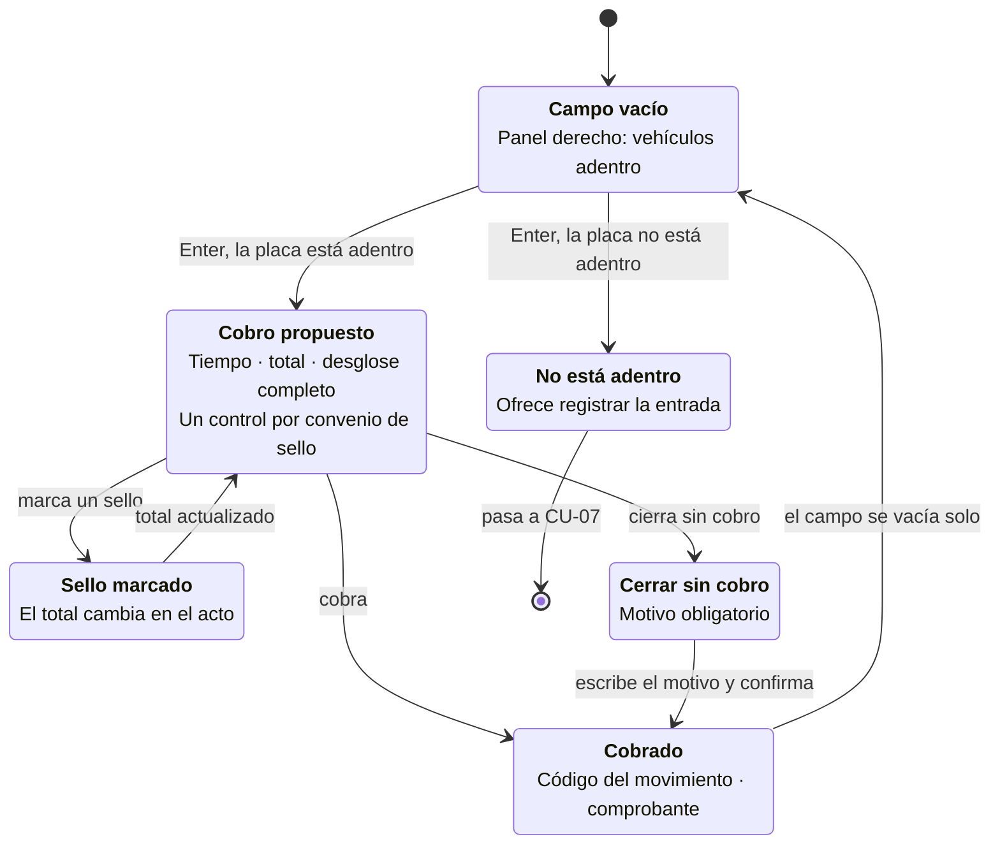

# CU-08 · Diagrama de interfaz

## Los estados de la pantalla



## La pantalla

```
┌────────────────────────────────────────────────────────────────┐
│  PARQUIVO            Taquilla                    Turno: abierto │
├──────────────────────────────────────┬─────────────────────────┤
│   ┌──────────────────────────────┐   │  ADENTRO AHORA          │
│   │        A B C 1 2 3           │   │  ─────────────────────  │
│   └──────────────────────────────┘   │   XYZ89D      45 min    │
│                                      │   Ficha 3   1 h 02 min  │
│   Automóvil · entró 14:12            │                         │
│   Lleva 2 h 14 min                   │                         │
│                                      │                         │
│   ┌─ Desglose ───────────────────┐   │                         │
│   │ 2 h 14 min · 3 intervalos    │   │                         │
│   │ Tarifa automóvil     $ 9.000 │   │                         │
│   │ Papelería El Sol    −$ 2.000 │   │                         │
│   │ Droguería (ya usado hoy)   — │   │                         │
│   │ Redondeo a la cincuentena +50│   │                         │
│   │ ─────────────────────────────│   │                         │
│   │ TOTAL                $ 7.050 │   │                         │
│   └──────────────────────────────┘   │                         │
│                                      │                         │
│   Sellos:  [x] Papelería El Sol      │                         │
│            [ ] Droguería Central     │                         │
│                                      │                         │
│   [ Cobrar $7.050 ]   [ Sin cobro ]  │                         │
└──────────────────────────────────────┴─────────────────────────┘
```

## Las cuatro decisiones de interfaz

### El desglose no está escondido

No hay un enlace de «ver detalle». El desglose está a la vista junto al total,
porque la pregunta del cliente —«¿por qué pago eso?»— llega mientras el operario
tiene la pantalla delante, y buscar la respuesta en ese momento no es viable.

### Se dice también lo que NO se aplicó

La línea *«Droguería (ya usado hoy)»* es tan importante como los descuentos que
sí entraron. No es lo mismo «ese convenio no le cubre» que «ya lo usó dos veces
hoy», y el cliente que reclama merece la diferencia.

### Los sellos van rotulados con el nombre del comercio

Un control por cada convenio de sello vigente, con el nombre que el cliente ve
en su tique. El operario no tiene que traducir códigos.

Al marcar uno, el total se recalcula en el acto, sin recargar ni confirmar nada.

### El botón dice el importe

No dice «Cobrar»: dice «Cobrar $7.050». Lo que va a ocurrir queda escrito en el
control que lo provoca, y el operario no confirma a ciegas.

## Cerrar sin cobro

El botón existe porque el caso ocurre —el dueño, un proveedor, una cortesía— y
prohibirlo sólo produce cobros falsos de cero pesos. Pero **exige un motivo
escrito**, y queda registrado quién lo autorizó y cuánto se habría cobrado.

No es desconfianza: es lo que permite defender la decisión cuando alguien
pregunte a fin de mes.

## Accesibilidad

El ciclo se completa sin ratón. El contraste de todos los textos, incluidos los
números del desglose, se verificó con cálculo de luminancia en los dos temas.
