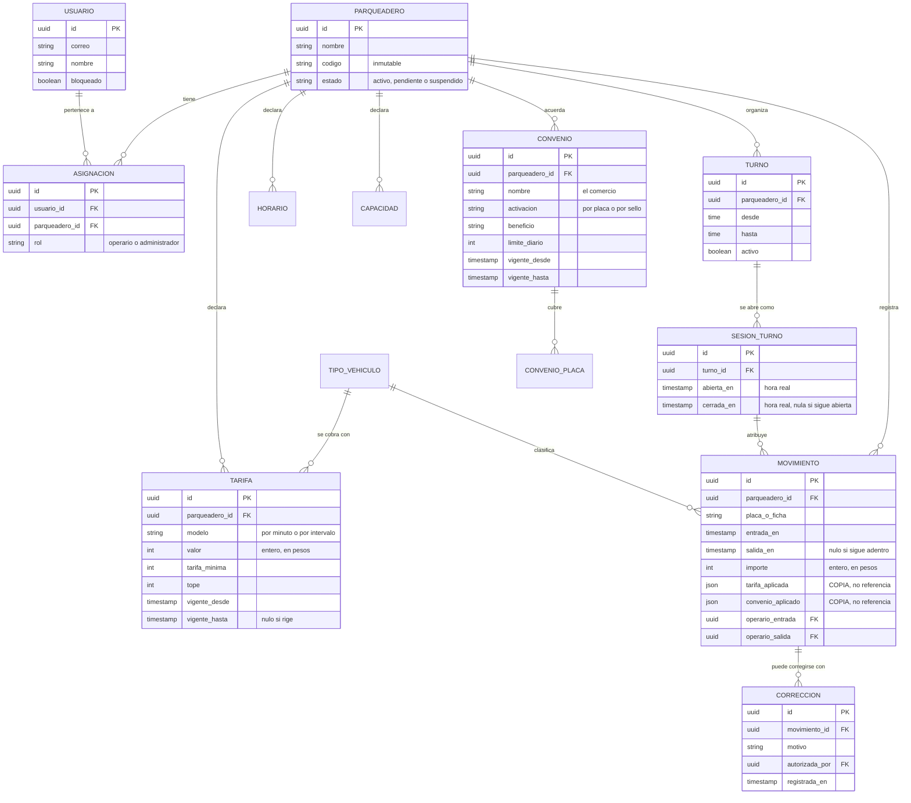

# Modelo entidad-relación

**Parquivo** · Fundamentos de Ingeniería de Software (12946) · 2026-2

Modelo conceptual del sistema. Es el producto del
[issue #3](https://github.com/Alexander-hub-co/Fundamentos_Ing_SW/issues/3),
cerrado en el Sprint 1.

---

## Diagrama

---

## Las cuatro decisiones que explican este modelo

### 1. Todo cuelga del parqueadero

`parqueadero_id` no es una columna más: es la **frontera de aislamiento**. Toda
entidad que contenga datos de un establecimiento la lleva, y la base de datos
—no el código de la aplicación— impide devolver filas de un establecimiento
distinto al de quien consulta.

Por eso el modelo no tiene una tabla global de movimientos con un filtro
opcional. El ámbito es obligatorio y se comprueba en el motor.

### 2. El movimiento guarda copias, no referencias

`tarifa_aplicada` y `convenio_aplicado` son documentos JSON **embebidos**, no
claves foráneas a `TARIFA` y `CONVENIO`.

Si fueran referencias, cambiar una tarifa hoy alteraría lo que se cobró el año
pasado, y el historial dejaría de poder explicarse. Guardar la copia cuesta
espacio y resuelve el problema para siempre.

### 3. Las tarifas y los convenios se versionan, no se editan

`vigente_desde` y `vigente_hasta` convierten cada cambio en una fila nueva. La
anterior se cierra, no se borra.

Así se puede reconstruir qué regía en cualquier instante del pasado, que es lo
que hace falta para responder un reclamo.

### 4. Un movimiento cerrado no se toca

No hay operación de edición ni de borrado sobre `MOVIMIENTO`. Las correcciones
son filas de `CORRECCION` que apuntan al movimiento original y registran quién
las autorizó.

Un historial que se puede reescribir no sirve para auditar una caja que no
cuadra.

---

## Tipos de dato que no son negociables

| Campo | Tipo | Por qué |
|---|---|---|
| Todo importe | Entero | El punto flotante no representa exactamente los decimales y los errores se acumulan al sumar. En un producto cuya función es cuadrar la caja, un peso de diferencia es un fallo |
| Toda marca de tiempo | Con zona horaria | Un parqueadero que abre a las diez de la noche y cierra a las seis de la mañana cruza la medianoche a diario. Si la marca es ambigua, el cobro también |
| Identificadores | UUID | No revelan cuántos registros hay ni permiten adivinar el siguiente |
| `codigo` del parqueadero | Texto inmutable | Es lo que la gente lee y dice por teléfono. Cambiarlo rompe todo lo impreso |
