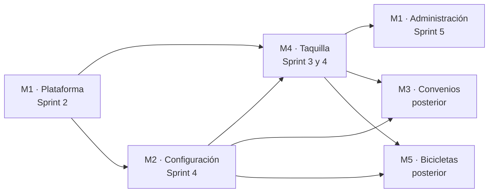

# Hoja de ruta por módulos

**Parquivo** · Fundamentos de Ingeniería de Software (12946) · 2026-2

El producto se partió en cinco módulos independientes. Cada uno tiene un rol
protagonista y una frontera que no invade a los demás, para que las
especificaciones no se pisen entre sí y cada módulo se pueda construir y probar
sin esperar al siguiente.

---

## Los cinco módulos

| # | Módulo | Rol protagonista | Frontera | Historias | Requisitos |
|---|---|---|---|:---:|:---:|
| **M1** | Plataforma y gestión de parqueaderos | Administrador general | Autenticación, modelo de tenencia, alta de establecimientos, estado de cuenta, gestión de usuarios | 13 | 53 |
| **M2** | Configuración del establecimiento | Administrador de parqueadero | Datos del establecimiento, horarios, tarifas, alta de operarios y turnos | 14 | 68 |
| **M3** | Convenios y descuentos | Administrador de parqueadero | Acuerdos con comercios, activación por placa o por sello, límites diarios | 6 | 20 |
| **M4** | Taquilla — vehículos | Operario | Placa, entrada, comprobante, salida y cobro | 10 | 30 |
| **M5** | Taquilla — bicicletas y fichas | Operario | Recepción, ficha, devolución y cobro | 8 | 23 |

**Total:** 51 historias de usuario y 194 requisitos funcionales.

---

## Orden de construcción y por qué

**M1 va primero y no es negociable.** El aislamiento entre establecimientos se
construye en los cimientos o no se construye. Montar la frontera de tenencia
después, sobre un esquema que ya tiene movimientos y tarifas, es el trabajo que
nunca se termina de hacer bien: basta una consulta olvidada para que un
establecimiento vea los movimientos de otro.

**M2 antes de poder cobrar.** No se puede cerrar una salida sin una tarifa
vigente. Por eso el Sprint 4 agrupa la configuración de tarifas y el motor de
cobro: la dependencia se resuelve dentro de un mismo sprint en vez de cruzar la
frontera entre dos.

**M3 y M5 quedan fuera de los cinco sprints.** Están especificados por completo
y se pueden construir cuando haya capacidad, pero se prefirió entregar el cobro
de vehículos terminado y verificado antes que cinco módulos a medias. Son
también el margen del plan: si la velocidad real cae por debajo de lo estimado,
el alcance ya viene recortado de antemano y no hay que improvisar el recorte
sobre la marcha.

---

## Decisiones de arquitectura

Estas decisiones gobiernan los cinco módulos y no se revisan por conveniencia de
uno solo.

### Aislamiento por fila, verificado en la base de datos

Cada establecimiento es una frontera de datos. El aislamiento **no** se
implementa comprobando un identificador en el código de la aplicación, sino con
seguridad a nivel de fila en PostgreSQL: aunque una consulta olvide filtrar, la
base de datos no devuelve filas ajenas.

*Por qué:* una comprobación en el código depende de que nadie la olvide nunca.
Una comprobación en el motor se cumple aunque alguien la olvide. Y cuando el
producto maneja el dinero de terceros, el modo de fallo aceptable no es
«casi siempre».

*La alternativa descartada* fue un esquema separado por establecimiento. Aísla
igual de bien, pero multiplica las migraciones por el número de clientes y
convierte cada cambio de estructura en una operación de riesgo creciente.

### Los montos son enteros

El dinero se guarda en pesos colombianos enteros, nunca en punto flotante.

*Por qué:* el punto flotante no representa exactamente los decimales y los
errores se acumulan al sumar. En un producto donde cuadrar la caja al cierre es
la función principal, un peso de diferencia es un fallo.

### El cobro guarda una copia, no una referencia

Al cerrar un movimiento se almacena el importe junto con **una copia** de la
tarifa y de los convenios aplicados en ese instante.

*Por qué:* si se guardara una referencia, cambiar una tarifa mañana alteraría lo
que se cobró ayer. El historial dejaría de poder explicarse, que es justamente
lo que el producto promete.

### Un movimiento cerrado no se modifica

Ni se edita ni se elimina. Las correcciones se registran como asientos nuevos
que referencian el original.

*Por qué:* un historial que se puede reescribir no sirve para responder un
reclamo ni para auditar una caja que no cuadra.

### El cálculo del cobro es una operación pura

Dadas una configuración y una permanencia, el calculador entrega siempre el
mismo importe y, además del total, el desglose que lo justifica.

*Por qué:* así se puede probar sin base de datos, sin reloj y sin sesión, que es
la única forma de tener confianza en la pieza que decide cuánto paga la gente.

### La regla del tipo de vehículo vive aislada

El tipo se deduce del último carácter de la placa —dígito es carro, letra es
moto—, y esa regla vive en un solo sitio, probada aparte, y se puede sustituir
sin tocar el flujo de registro.

*Por qué:* es una convención colombiana, no una ley de la naturaleza. Aislarla
cuesta poco hoy y evita reescribir la taquilla el día que deje de valer.

### Las marcas de tiempo no son ambiguas

Se guardan sin ambigüedad de zona horaria y el horario del establecimiento se
interpreta en la zona de Colombia, sin exponer al administrador a elegirla.

*Por qué:* un parqueadero que abre a las diez de la noche y cierra a las seis de
la mañana cruza la medianoche todos los días. Si la marca de tiempo es ambigua,
el cobro de media jornada también lo es.

---

## Lo que queda fuera del alcance

| Qué | Por qué no está |
|---|---|
| Pasarela de pagos y facturación | El estado de la cuenta —activa, pendiente, suspendida— sí está, porque es un campo y una regla de autorización. Cobrar de verdad es un producto aparte |
| Aplicación móvil nativa | La interfaz responde en teléfono desde el navegador. Una aplicación nativa no agrega nada que el operario necesite |
| Reconocimiento automático de placas | Se evaluó y se descartó: exige cámara, iluminación y mantenimiento que un parqueadero de 30 a 150 cupos no va a sostener. El operario escribe la placa más rápido de lo que un lector se equivoca |
| Reserva anticipada de cupo | No es el problema que el producto resuelve. Añadirlo cambiaría el modelo de ocupación entero |
