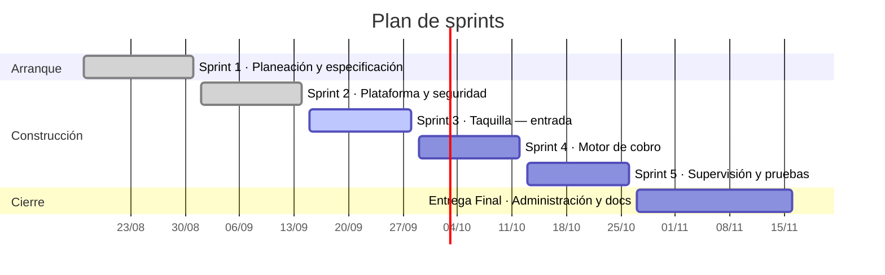

# Calendario de actividades

**Parquivo** · Fundamentos de Ingeniería de Software (12946) · 2026-2

Sprints de dos semanas. Cada sprint corresponde a un hito del repositorio, y
cada historia vive como *issue* asignado a una persona con su estimación en
puntos.

---

## Vista general

---

## Sprint 1 · Planeación y especificación · 18 puntos · cerrado

**17 de agosto – 31 de agosto de 2026**

Objetivo: entender el problema y dejarlo escrito antes de construir nada.

| # | Tarea | Puntos | Responsable | Estado |
|---|---|:---:|---|---|
| [#3](https://github.com/Alexander-hub-co/Fundamentos_Ing_SW/issues/3) | Diseñar el modelo de base de datos | 8 | Jacob Riveros | Cerrada el 24/08 |
| [#4](https://github.com/Alexander-hub-co/Fundamentos_Ing_SW/issues/4) | Diseñar los wireframes de la interfaz web | 5 | Cristian Quevedo | Cerrada el 24/08 |
| [#11](https://github.com/Alexander-hub-co/Fundamentos_Ing_SW/issues/11) | Diseñar la arquitectura general del sistema | 5 | Sergio Alexander L. | Cerrada el 24/08 |

Además, y sin pasar por el tablero porque su producto son documentos y no
código, en este sprint se levantó la especificación:

| Actividad | Resultado |
|---|---|
| Definir el alcance y los módulos | Cinco módulos: plataforma, configuración, convenios, taquilla de vehículos y taquilla de bicicletas |
| Escribir la especificación de requisitos | `Docs/SRS/SRS-simplificado.md` |
| Redactar las historias de usuario | 51 historias con criterios de aceptación en `Docs/Entrega-1/historias-de-usuario.md` |
| Modelar el producto | Canvas y modelo de características |
| Levantar los casos de uso | Seis flujos principales con sus alternativas |
| Montar el repositorio | Estructura de carpetas, hitos, etiquetas y flujo de ramas |

Los 18 puntos cerrados en este sprint fueron la primera medida de velocidad real
del equipo, y son los que sostuvieron el compromiso de los sprints siguientes.

---

## Sprint 2 · Plataforma y seguridad · 21 puntos · cerrado

**1 de septiembre – 14 de septiembre de 2026**

Objetivo: que existan cuentas, que cada quien vea sólo lo suyo y que el dinero
se represente bien desde el primer registro.

| # | Historia | Puntos | Responsable |
|---|---|:---:|---|
| [#24](https://github.com/Alexander-hub-co/Fundamentos_Ing_SW/issues/24) | Aislamiento en consulta de movimientos | 8 | Cristian Quevedo |
| [#25](https://github.com/Alexander-hub-co/Fundamentos_Ing_SW/issues/25) | Autorización de rol para operaciones de creación | 5 | Sergio Alexander L. |
| [#2](https://github.com/Alexander-hub-co/Fundamentos_Ing_SW/issues/2) | Login en el sistema | 5 | Jacob Riveros |
| [#28](https://github.com/Alexander-hub-co/Fundamentos_Ing_SW/issues/28) | Registro de montos en pesos sin decimales | 3 | Santiago Arias |

El aislamiento va primero y no es negociable: montarlo después, sobre un
esquema que ya tiene movimientos y tarifas, es el trabajo que nunca se termina
de hacer bien.

**Resultado: 21 de 21 puntos.** Las cuatro historias quedaron cerradas dentro
del sprint.

---

## Sprint 3 · Taquilla — entrada · 24 puntos · en curso

**15 de septiembre – 28 de septiembre de 2026**

Objetivo: que un vehículo pueda entrar, que el sistema deduzca su tipo solo y
que lo registrado no se pueda alterar después.

Es el sprint en curso. Cierra el 28 de septiembre.

| # | Historia | Puntos | Responsable |
|---|---|:---:|---|
| [#5](https://github.com/Alexander-hub-co/Fundamentos_Ing_SW/issues/5) | Registro de entrada de vehículos | 8 | Cristian Quevedo |
| [#31](https://github.com/Alexander-hub-co/Fundamentos_Ing_SW/issues/31) | Determinar entrada o salida según la placa | 8 | Santiago Arias |
| [#26](https://github.com/Alexander-hub-co/Fundamentos_Ing_SW/issues/26) | Bloqueo de edición y eliminación de movimientos cerrados | 5 | Jacob Riveros |
| [#32](https://github.com/Alexander-hub-co/Fundamentos_Ing_SW/issues/32) | Rechazo de entrada duplicada | 3 | Sergio Alexander L. |

---

## Sprint 4 · Motor de cobro · 24 puntos

**29 de septiembre – 12 de octubre de 2026**

Objetivo: que se pueda cobrar una salida y que el cobro se pueda explicar.

| # | Historia | Puntos | Responsable |
|---|---|:---:|---|
| [#27](https://github.com/Alexander-hub-co/Fundamentos_Ing_SW/issues/27) | Copia de tarifa y convenio al momento del cobro | 8 | Jacob Riveros |
| [#10](https://github.com/Alexander-hub-co/Fundamentos_Ing_SW/issues/10) | Registro de salida de vehículos | 8 | Sergio Alexander L. |
| [#30](https://github.com/Alexander-hub-co/Fundamentos_Ing_SW/issues/30) | Detalle del cálculo del cobro | 5 | Santiago Arias |
| [#33](https://github.com/Alexander-hub-co/Fundamentos_Ing_SW/issues/33) | Tarifa obligatoria antes del primer cobro | 3 | Cristian Quevedo |

Los cuatro van juntos a propósito: la salida es lo que dispara el cálculo del
importe, guardar una copia de la tarifa aplicada sin poder mostrar el desglose no
sirve de nada, y mostrar un desglose que mañana cambia porque cambió la tarifa es
peor que no mostrarlo.

---

## Sprint 5 · Supervisión y pruebas · 21 puntos

**13 de octubre – 26 de octubre de 2026**

Objetivo: que el administrador pueda vigilar su establecimiento de lejos y que
lo construido tenga red de seguridad.

| # | Historia | Puntos | Responsable |
|---|---|:---:|---|
| [#8](https://github.com/Alexander-hub-co/Fundamentos_Ing_SW/issues/8) | Módulo de consulta y supervisión remota | 8 | Cristian Quevedo |
| [#29](https://github.com/Alexander-hub-co/Fundamentos_Ing_SW/issues/29) | Historial de versiones de tarifa por tipo de vehículo | 5 | Sergio Alexander L. |
| [#7](https://github.com/Alexander-hub-co/Fundamentos_Ing_SW/issues/7) | Pruebas unitarias de registro de entradas y salidas | 5 | Santiago Arias |
| [#12](https://github.com/Alexander-hub-co/Fundamentos_Ing_SW/issues/12) | Pruebas de acceso remoto y disponibilidad | 3 | Jacob Riveros |

---

## Entrega Final · Administración y documentación · 14 puntos

**27 de octubre – 16 de noviembre de 2026**

| # | Actividad | Puntos | Responsable |
|---|---|:---:|---|
| [#9](https://github.com/Alexander-hub-co/Fundamentos_Ing_SW/issues/9) | Gestión de usuarios y permisos | 8 | Sergio Alexander L. |
| [#6](https://github.com/Alexander-hub-co/Fundamentos_Ing_SW/issues/6) | Documentar el despliegue del entorno de producción | 3 | Jacob Riveros |
| [#13](https://github.com/Alexander-hub-co/Fundamentos_Ing_SW/issues/13) | Manual de usuario para empleados | 3 | Santiago Arias |

La gestión de usuarios y permisos se dejó para el final a propósito: es
administrativa y no está en el camino crítico del cobro, así que es lo primero
que puede esperar cuando algo más urgente se corre. Aun así quedan tres semanas
para catorce puntos, margen suficiente para absorber lo que se atrase.

---

## Reparto de la carga

| Sprint | Cristian | Sergio | Jacob | Santiago | Total |
|---|:---:|:---:|:---:|:---:|:---:|
| Sprint 2 | 8 | 5 | 5 | 3 | **21** |
| Sprint 3 | 8 | 3 | 5 | 8 | **24** |
| Sprint 4 | 3 | 8 | 8 | 5 | **24** |
| Sprint 5 | 8 | 5 | 3 | 5 | **21** |
| Entrega Final | — | 8 | 3 | 3 | **14** |
| **Total** | **27** | **29** | **24** | **24** | **104** |

Las cuatro personas participan en los cuatro sprints de construcción, ningún
sprint pasa de 24 puntos y la diferencia entre quien más carga y quien menos es
de cinco puntos sobre un total de ciento cuatro.

La escala es Fibonacci: 1, 2, 3, 5, 8, 13. Una historia de 13 se parte antes de
entrar a un sprint. Los puntos se revisan en cada planeación y se ajustan con lo
que el equipo aprendió del sprint anterior.
