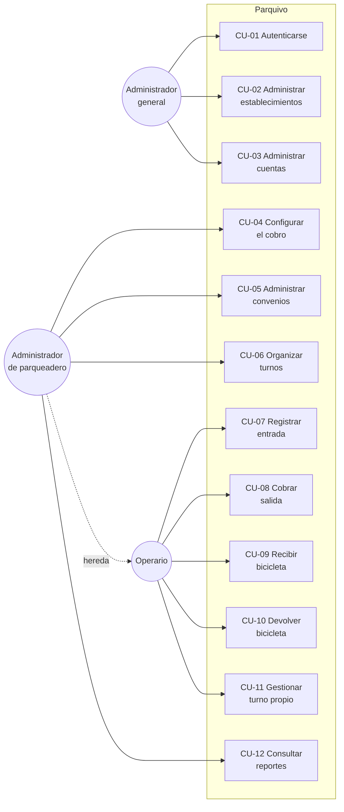

# Casos de uso

**Parquivo** · Sistema de gestión para parqueaderos

---

## Actores

| Actor | Descripción |
|---|---|
| **Administrador general** | Opera la plataforma. Da de alta establecimientos y cuentas |
| **Administrador de parqueadero** | Configura y supervisa un establecimiento. Hereda todo lo del operario |
| **Operario** | Atiende la caseta de la taquilla |
| **Sistema** | Actor no humano: dispara la purga de datos personales por plazo cumplido |

El administrador de parqueadero **hereda** del operario: hay establecimientos
donde el dueño atiende la caseta, y obligarlo a tener dos cuentas para cobrar
un carro sería absurdo.

---

## Diagrama general

---

## CU-07 · Registrar la entrada de un vehículo

| | |
|---|---|
| **Actor principal** | Operario |
| **Precondición** | El operario está autenticado y el establecimiento está activo |
| **Postcondición** | Existe un movimiento abierto para esa placa |
| **Requisitos** | FR-001 a FR-007 del módulo M4 |

**Flujo principal**

1. El operario escribe la placa en el campo de la taquilla y pulsa Enter.
2. El sistema normaliza la placa: quita espacios y la pasa a mayúsculas.
3. El sistema comprueba que la placa no corresponde a un vehículo ya presente.
4. El sistema deduce el tipo: dígito final es automóvil, letra final es
   motocicleta.
5. El sistema consulta la tarifa vigente para ese tipo y la muestra.
6. El operario confirma.
7. El sistema registra el movimiento con la hora, el operario y el turno
   abierto.
8. El sistema emite el comprobante.

**Flujos alternativos**

| Nº | Condición | Qué ocurre |
|---|---|---|
| 3a | La placa ya está presente | El sistema no ofrece entrada: pasa a **CU-08** con el tiempo y el importe |
| 4a | La placa no corresponde a ningún formato conocido | El sistema la rechaza con un error explícito y no adivina el tipo |
| 5a | El tipo no tiene tarifa vigente | El sistema lo advierte antes de confirmar |
| 8a | La impresora no responde | El movimiento queda registrado y el comprobante pasa a la lista de pendientes |
| — | El establecimiento está suspendido | El sistema impide la entrada, con su explicación |

---

## CU-08 · Cobrar la salida de un vehículo

| | |
|---|---|
| **Actor principal** | Operario |
| **Precondición** | Existe un movimiento abierto para esa placa |
| **Postcondición** | El movimiento queda cerrado, con importe y copia de las condiciones |
| **Requisitos** | FR-008 a FR-019 del módulo M4 |

**Flujo principal**

1. El operario escribe la placa y pulsa Enter.
2. El sistema reconoce que el vehículo está presente y calcula la permanencia.
3. El sistema aplica los convenios de activación por placa que correspondan.
4. El sistema calcula el importe y su desglose.
5. El sistema muestra el total, el tiempo y el desglose completo.
6. El operario confirma el cobro.
7. El sistema cierra el movimiento guardando el importe y **una copia** de la
   tarifa y del convenio aplicados.
8. El sistema emite el comprobante de salida si se solicitó.

**Flujos alternativos**

| Nº | Condición | Qué ocurre |
|---|---|---|
| 3a | El convenio se activa por sello | El sistema ofrece marcarlo y recalcula en el acto |
| 5a | El establecimiento pide confirmar antes de cobrar | Se añade un paso de confirmación explícita |
| 6a | El operario cierra sin cobro | El sistema exige un motivo escrito y registra quién lo autorizó y cuánto se habría cobrado |
| 8a | La impresora no responde | El comprobante pasa a pendientes y la operación continúa |

---

## CU-09 · Recibir una bicicleta

| | |
|---|---|
| **Actor principal** | Operario |
| **Precondición** | El establecimiento declaró capacidad de bicicletas y queda espacio |
| **Postcondición** | Existe un movimiento abierto con un número de ficha asignado |
| **Requisitos** | FR-005 a FR-010 del módulo M5 |

**Flujo principal**

1. El operario abre la recepción de bicicletas.
2. El operario escribe el nombre, el celular y la cédula de quien la deja.
3. El sistema asigna automáticamente un número de ficha libre.
4. El sistema registra el movimiento.
5. El sistema emite el comprobante con el número de ficha destacado.

**Flujos alternativos**

| Nº | Condición | Qué ocurre |
|---|---|---|
| 2a | La cédula ya se registró antes | El sistema propone el teléfono que dio esa vez |
| 3a | No quedan fichas disponibles | El sistema rechaza la recepción y dice por qué |
| 3b | Dos operarios reciben a la vez | El sistema garantiza números distintos |

---

## CU-10 · Devolver una bicicleta

| | |
|---|---|
| **Actor principal** | Operario |
| **Precondición** | Existe un movimiento abierto con esa ficha |
| **Postcondición** | El movimiento queda cerrado y la ficha vuelve a estar disponible |
| **Requisitos** | FR-011 a FR-016 del módulo M5 |

**Flujo principal**

1. El operario escribe el número de ficha en el campo de la taquilla.
2. El sistema distingue que es una ficha y no una placa.
3. El sistema calcula el importe con la tarifa de bicicleta vigente.
4. El operario confirma el cobro.
5. El sistema cierra el movimiento y libera el número de ficha.

**Flujos alternativos**

| Nº | Condición | Qué ocurre |
|---|---|---|
| 1a | El cliente perdió el tique | El operario busca el movimiento por la cédula |
| 2a | La ficha no está entregada | El sistema lo rechaza sin registrar nada |
| 3a | Hay un convenio aplicable | No se aplica, salvo que el administrador lo haya habilitado para bicicletas |

---

## CU-04 · Configurar el cobro

| | |
|---|---|
| **Actor principal** | Administrador de parqueadero |
| **Precondición** | El administrador está autenticado |
| **Postcondición** | Existe una tarifa vigente para el tipo de vehículo |
| **Requisitos** | FR-001 a FR-025 del módulo M2 |

**Flujo principal**

1. El administrador elige el tipo de vehículo.
2. El administrador elige el modelo de cobro: por minuto o por intervalos.
3. El administrador declara los valores que ese modelo exige.
4. El sistema valida la coherencia de los valores.
5. El sistema cierra la vigencia de la versión anterior, si la había, y activa
   la nueva.

**Flujos alternativos**

| Nº | Condición | Qué ocurre |
|---|---|---|
| 4a | La tarifa mínima supera a la plena | El sistema rechaza el cambio |
| 4b | El intervalo es cero o negativo | El sistema lo rechaza |
| 5a | Se intenta borrar una tarifa que llegó a regir | El sistema lo impide: se cierra su vigencia, no se elimina |

---

## CU-11 · Gestionar el turno propio

| | |
|---|---|
| **Actor principal** | Operario |
| **Precondición** | Existe un turno declarado para ese día |
| **Postcondición** | Queda registrada la sesión con sus horas reales |
| **Requisitos** | FR-020 a FR-024 del módulo M4 |

**Flujo principal**

1. El operario abre su turno al llegar.
2. El sistema registra la hora **real** de apertura, además de la programada.
3. Los movimientos que atienda quedan atribuidos a esa sesión.
4. El operario cierra el turno al irse.
5. El sistema registra la hora real de cierre.

**Flujos alternativos**

| Nº | Condición | Qué ocurre |
|---|---|---|
| 1a | El turno está desactivado | El sistema impide abrirlo |
| 4a | Quedan vehículos adentro | El sistema permite cerrar igual: los vehículos son del establecimiento, no del turno |
| — | No hay ningún turno abierto | Se puede atender igual; los movimientos quedan sin turno asociado |

---

## Trazabilidad

| Caso de uso | Historias de usuario |
|---|---|
| CU-01 Autenticarse | HU-1.1.3 |
| CU-02 Administrar establecimientos | HU-1.1.1, HU-1.1.2, HU-1.3.1, HU-1.3.2, HU-1.5.1 |
| CU-03 Administrar cuentas | HU-1.4.1 a HU-1.4.4, HU-2.3.1 a HU-2.3.3 |
| CU-04 Configurar el cobro | HU-2.1.1 a HU-2.1.5, HU-2.2.1 a HU-2.2.3 |
| CU-05 Administrar convenios | HU-3.1.1 a HU-3.1.4, HU-3.2.1, HU-3.2.2 |
| CU-06 Organizar turnos | HU-2.4.1 a HU-2.4.3 |
| CU-07 Registrar entrada | HU-4.1.1, HU-4.1.2, HU-4.1.5 |
| CU-08 Cobrar salida | HU-4.1.3, HU-4.1.4, HU-4.1.6, HU-4.1.7 |
| CU-09 Recibir bicicleta | HU-5.1.1 a HU-5.1.3, HU-5.5.1 |
| CU-10 Devolver bicicleta | HU-5.2.1 a HU-5.2.3, HU-5.4.1 |
| CU-11 Gestionar turno propio | HU-4.2.1, HU-4.2.2 |
| CU-12 Consultar reportes | HU-4.3.1 |

**HU-1.2.1, HU-1.2.2 y HU-1.2.3 no aparecen en esta tabla a propósito.** No
describen un caso de uso sino una restricción que gobierna a todos: que cada
quien vea únicamente lo suyo, que lo ajeno responda igual que lo inexistente y
que los permisos se evalúen en el servidor. Se verifican en cada caso de uso,
no en uno.
