# Feature Model

**Parquivo** · Descomposición funcional del sistema

---

## Notación

| Símbolo | Significado |
|---|---|
| **●** | **Obligatoria** — sin ella el sistema no funciona |
| **○** | **Opcional** — el establecimiento decide si la usa |
| **⊕** | **Alternativa (XOR)** — se elige exactamente una del grupo |
| **⊙** | **Or** — se elige una o más del grupo |

---

## El árbol

```mermaid
flowchart TD
    P["<b>PARQUIVO</b>"]

    P --- M1["● M1<br/>Plataforma"]
    P --- M2["● M2<br/>Configuración"]
    P --- M3["○ M3<br/>Convenios"]
    P --- M4["● M4<br/>Taquilla · vehículos"]
    P --- M5["○ M5<br/>Taquilla · bicicletas"]

    M1 --- F11["● Autenticación"]
    M1 --- F12["● Aislamiento<br/>por establecimiento"]
    M1 --- F13["● Gestión de<br/>establecimientos"]
    M1 --- F14["● Gestión<br/>de cuentas"]
    M1 --- F15["○ Panel global"]

    M2 --- F21["● Tarifas"]
    M2 --- F22["● Horario"]
    M2 --- F23["● Capacidad"]
    M2 --- F24["○ Equipo"]
    M2 --- F25["○ Turnos"]

    M3 --- F31["● Declaración<br/>de convenios"]
    M3 --- F32["● Motor de<br/>descuentos"]
    M3 --- F33["○ Redondeo"]
    M3 --- F34["○ Comprobador"]

    M4 --- F41["● Resolución<br/>por placa"]
    M4 --- F42["● Entrada"]
    M4 --- F43["● Salida y cobro"]
    M4 --- F44["○ Cortesía"]
    M4 --- F45["○ Comprobante<br/>impreso"]
    M4 --- F46["○ Ocupación"]

    M5 --- F51["● Recepción<br/>con ficha"]
    M5 --- F52["● Devolución"]
    M5 --- F53["○ Búsqueda<br/>por cédula"]
```

---

## Detalle por módulo

### M1 · Plataforma ●

| | Característica | Descripción |
|---|---|---|
| ● | **Autenticación** | Acceso con credenciales propias y cambio obligatorio de la contraseña temporal |
| ● | **Aislamiento por establecimiento** | Cada uno ve únicamente sus datos, impuesto por la base de datos |
| ● | **Gestión de establecimientos** | Alta, edición, estados y baja lógica |
| ● | **Gestión de cuentas** | Crear, bloquear, restablecer contraseña, dar de baja y anonimizar |
| ○ | Panel global | Resumen de la plataforma para el administrador general |

**Alternativa dentro del estado del establecimiento ⊕** — exactamente uno a la vez:
`pendiente` · `activo` · `suspendido` · `dado de baja`

---

### M2 · Configuración del establecimiento ●

| | Característica | Descripción |
|---|---|---|
| ● | **Tarifas** | Al menos una declarada antes del primer cobro |
| ● | **Horario de atención** | Cuándo abre y cuándo cierra |
| ● | **Capacidad** | Cuántos cupos hay por tipo de vehículo |
| ○ | Equipo | Alta de operarios y sus permisos |
| ○ | Turnos | Declaración y asignación de personas |

**Modelo de cobro ⊕** — se elige uno por tipo de vehículo:

| | Opción | Cómo cobra |
|---|---|---|
| ⊕ | **Por minuto** | Tarifa por minuto, con mínima y plena |
| ⊕ | **Por intervalos** | Cada fracción cobra el intervalo completo |

**Horario ⊕** — se elige uno:

| | Opción |
|---|---|
| ⊕ | Abierto las 24 horas |
| ⊕ | Franjas por día de la semana |

**Política de horas cerradas ⊕** — se elige una:

| | Opción |
|---|---|
| ⊕ | Se cobran las horas en que estuvo cerrado |
| ⊕ | No se cobran |

---

### M3 · Convenios y descuentos ○

Un parqueadero funciona perfectamente sin ninguno: se cobra tarifa plena a todo
el mundo. Por eso el módulo entero es opcional.

| | Característica | Descripción |
|---|---|---|
| ● | **Declaración de convenios** | Sólo si el módulo se usa |
| ● | **Motor de descuentos** | Aplicación en orden declarado, sin resultados negativos |
| ○ | Redondeo | Regla configurable por establecimiento |
| ○ | Comprobador | Simular un cobro antes de prometerlo |

**Activación ⊕** — cada convenio elige una:

| | Opción | Cuándo aplica |
|---|---|---|
| ⊕ | **Por placa** | El vehículo está en la lista del convenio |
| ⊕ | **Por sello** | El cliente llega con el tique sellado por el comercio |

**Beneficio ⊕** — cada convenio elige uno:

| | Opción |
|---|---|
| ⊕ | Minutos gratis |
| ⊕ | Porcentaje de descuento |
| ⊕ | Tarifa fija |
| ⊕ | Sin cobro |

**Vigencia ⊕** — se elige una:

| | Opción |
|---|---|
| ⊕ | Sin vencimiento |
| ⊕ | Por duración |
| ⊕ | Hasta una fecha |

---

### M4 · Taquilla — vehículos ●

Es el núcleo del producto. Sin este módulo no hay sistema.

| | Característica | Descripción |
|---|---|---|
| ● | **Resolución por placa** | Un solo campo decide si el vehículo entra o sale |
| ● | **Registro de entrada** | Con clasificación automática del tipo |
| ● | **Salida y cobro** | Con desglose del importe |
| ○ | Cortesía | Salida sin cobro, con motivo obligatorio |
| ○ | Comprobante impreso | Si falla, la operación continúa |
| ○ | Ocupación | Cuántos hay adentro, contra la capacidad declarada |
| ○ | Turnos en taquilla | Abrir y cerrar sesión de turno |
| ○ | Correcciones | Enmendar un cobro cerrado, con auditoría |

**Clasificación del vehículo ⊕** — se deduce, no se elige:

| | Opción | Regla |
|---|---|---|
| ⊕ | Automóvil | La placa termina en dígito |
| ⊕ | Motocicleta | La placa termina en letra |

---

### M5 · Taquilla — bicicletas ○

Un parqueadero que sólo recibe carros no necesita este módulo. Se activa
declarando capacidad de bicicletas.

| | Característica | Descripción |
|---|---|---|
| ● | **Recepción con ficha** | Asignación automática del número, con datos de quien la deja |
| ● | **Devolución y cobro** | Por número de ficha, con la tarifa de bicicleta |
| ○ | Búsqueda por cédula | Para cuando el cliente perdió el tique |
| ○ | Convenios en bicicletas | Por omisión no aplican; el administrador puede habilitarlos |

---

## Reglas de composición

Restricciones entre características, en el sentido del modelado de líneas de
producto:

| Regla | Enunciado |
|---|---|
| **Requiere** | `M3 · Convenios` **requiere** `M2 · Tarifas` — no se puede descontar sobre un precio que no existe |
| **Requiere** | `M5 · Bicicletas` **requiere** una tarifa de bicicleta declarada |
| **Requiere** | `Turnos en taquilla` **requiere** `M2 · Turnos` declarados |
| **Requiere** | `Ocupación` **requiere** `M2 · Capacidad` declarada |
| **Requiere** | `Correcciones` **requiere** `M1 · Gestión de cuentas`, porque la delegación se otorga a una persona |
| **Excluye** | `Convenio por sello` **excluye** la lista de placas del mismo convenio |
| **Excluye** | `Sin cobro` **excluye** cualquier otro beneficio en el mismo convenio |

---

## Configuraciones válidas

Tres ejemplos de establecimiento real y qué características activaría cada uno:

| Establecimiento | Módulos activos |
|---|---|
| **Parqueadero de barrio**, sólo carros, sin acuerdos | M1 + M2 + M4 |
| **Parqueadero de centro comercial** con convenios | M1 + M2 + M3 + M4 |
| **Parqueadero completo** con bicicletas | M1 + M2 + M3 + M4 + M5 |

Ninguna de las tres exige tocar el código: se declara la configuración y el
sistema se comporta en consecuencia.
