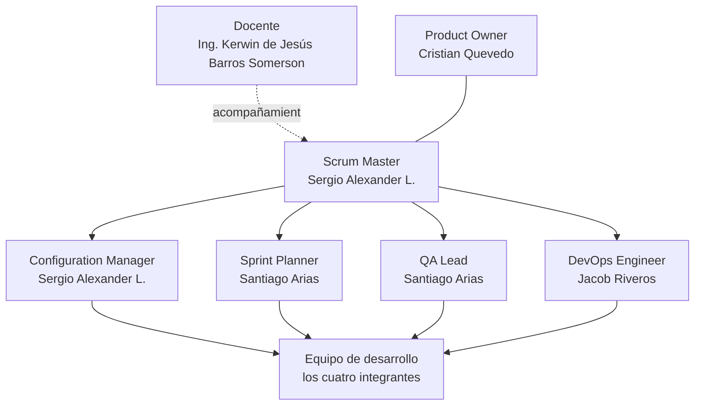

# Organigrama y roles

**Parquivo** · Fundamentos de Ingeniería de Software (12946) · 2026-2

---

## Estructura del equipo

El equipo son cuatro personas y los roles son seis, así que **dos integrantes
sostienen dos roles cada uno y los cuatro desarrollan**. Scrum no lo prohíbe, y
en un equipo de este tamaño lo contrario dejaría a dos personas escribiendo todo
el código.

---

## Roles

### Product Owner — Cristian Quevedo · [@CristianQ8907E](https://github.com/CristianQ8907E)

Responde por **qué se construye y en qué orden**.

- Mantiene el backlog y decide la prioridad de cada historia.
- Es la fuente de verdad del dominio: qué significa cobrar bien, qué es un
  convenio, por qué un movimiento cerrado no se toca.
- Acepta o rechaza cada historia contra sus criterios de aceptación.
- Escribe y mantiene la especificación de requisitos.

### Scrum Master — Sergio Alexander L. · [@Alexander-hub-co](https://github.com/Alexander-hub-co)

Responde por **que el proceso funcione**.

- Convoca y modera la planeación, la revisión y la retrospectiva de cada sprint.
- Retira los impedimentos que frenan al equipo.
- Vigila que el alcance del sprint no cambie a mitad de camino.

### Configuration Manager — Sergio Alexander L. · [@Alexander-hub-co](https://github.com/Alexander-hub-co)

Responde por **el estado del repositorio y de las versiones**.

- Administra permisos, hitos, etiquetas y el flujo de ramas.
- Vigila que ningún cambio llegue a `main` sin pasar por una rama y su revisión.
- Mantiene la trazabilidad entre lo que se acordó y lo que está publicado.

### Sprint Planner — Santiago Arias · [@IngSantiArias](https://github.com/IngSantiArias)

Responde por **que el sprint quepa en el sprint**.

- Prepara el material de la planeación y la demostración de la revisión.
- Vigila que ningún sprint pase del tope de puntos que el equipo acordó.
- Lleva la cuenta de la velocidad medida y la contrasta con lo comprometido.

### QA Lead — Santiago Arias · [@IngSantiArias](https://github.com/IngSantiArias)

Responde por **que lo entregado esté probado**.

- Revisa que cada historia tenga criterios de aceptación verificables antes de
  entrar a un sprint.
- Mantiene la suite de pruebas automatizadas y vigila que corra en verde.
- Comprueba lo terminado contra sus criterios antes de la revisión del sprint.

### DevOps Engineer — Jacob Riveros · [@JacobRiveros67](https://github.com/JacobRiveros67)

Responde por **que el sistema se pueda desplegar y siga en pie**.

- Documenta el despliegue del entorno de producción.
- Comprueba el acceso remoto y la disponibilidad del sistema.
- Mantiene las comprobaciones que corren antes de integrar un cambio.

### Equipo de desarrollo

Los cuatro. Cada persona tiene además un frente técnico, que no es una frontera
cerrada sino el sitio donde se concentra su trabajo y a quien se le pregunta
primero.

| Persona | Frente técnico | De qué responde |
|---|---|---|
| Cristian Quevedo | Dominio y reglas de negocio | Aislamiento entre establecimientos, registro de entrada, obligatoriedad de la tarifa, supervisión remota |
| Sergio Alexander L. | Seguridad y permisos | Autorización por rol, rechazo de entradas duplicadas, versionado de tarifas, gestión de usuarios |
| Jacob Riveros | Integridad del historial | Login, inmutabilidad de los movimientos cerrados, copia de tarifa y convenio en el cobro, pruebas de acceso |
| Santiago Arias | Modelo de datos y taquilla | Montos en enteros, clasificación por placa, desglose del cobro, pruebas unitarias |

### Docente — Ing. Kerwin de Jesús Barros Somerson · [@kbarrosDev](https://github.com/kbarrosDev)

Acompaña y evalúa. No es parte del equipo de desarrollo ni se le asignan
tareas del backlog.

---

## Matriz de responsabilidad

**R** ejecuta · **A** responde por el resultado · **C** se consulta · **I** se informa

| Actividad | Cristian | Sergio | Jacob | Santiago |
|---|:---:|:---:|:---:|:---:|
| Priorizar el backlog | A | C | C | C |
| Aceptar una historia terminada | A | I | I | I |
| Planear el sprint | C | A | R | R |
| Estimar en puntos | R | R | R | R |
| Administrar el repositorio | I | A | I | I |
| Revisar un *pull request* | R | R | R | R |
| Especificar requisitos | A | C | C | C |
| Diseñar el modelo de datos | C | C | I | A |
| Definir permisos y roles | C | A | I | I |
| Escribir pruebas | C | I | A | R |
| Documentar despliegue y manual | I | I | A | R |
| Retrospectiva | R | A | R | R |

Ninguna actividad tiene dos **A**: siempre hay una sola persona que responde
por el resultado, aunque varias lo ejecuten.

---

## Ceremonias

El equipo se reúne **los martes y los viernes después de clase, de 7:00 a 9:00
de la noche**, cadencia vigente desde el 25 de agosto de 2026. Los sprints cierran en lunes, de
modo que la revisión, la retrospectiva y la planeación del siguiente caen todas
dentro del bloque del martes posterior.

**Martes de cierre de sprint**

| Ceremonia | Horario | Quiénes | Dónde queda el registro |
|---|---|---|---|
| Revisión del sprint | 19:00 – 19:40 | Los cuatro, con demostración | [`Docs/Review/`](../Review/) |
| Retrospectiva | 19:40 – 20:10 | Los cuatro | [`Docs/Retrospective/`](../Retrospective/) |
| Planeación del sprint | 20:10 – 21:00 | Los cuatro | [`Docs/Planning/`](../Planning/) |

**Los demás martes y todos los viernes**

| Ceremonia | Horario | Quiénes | Dónde queda el registro |
|---|---|---|---|
| Sesión de trabajo | 19:00 – 21:00 | Los cuatro | [`Docs/Dailys/`](../Dailys/) |

La sesión de trabajo abre con una vuelta corta —en qué va cada uno y qué lo está
frenando— y el resto del bloque se trabaja en conjunto. Las decisiones que no
pertenecen a una ceremonia concreta se consignan como actas en
[`Docs/Actas/`](../Actas/).

La cadencia es de dos veces por semana y no diaria porque el equipo cursa otras
asignaturas, y una reunión diaria que nadie puede sostener se abandona en la
segunda semana. Se prefiere una que se cumpla. Se fijó en días y horas concretos
—martes y viernes, de 7 a 9 de la noche— para que no haya que convocarla cada
vez, y justo después de clase porque es cuando los cuatro ya están reunidos y
nadie tiene que desplazarse aparte.
