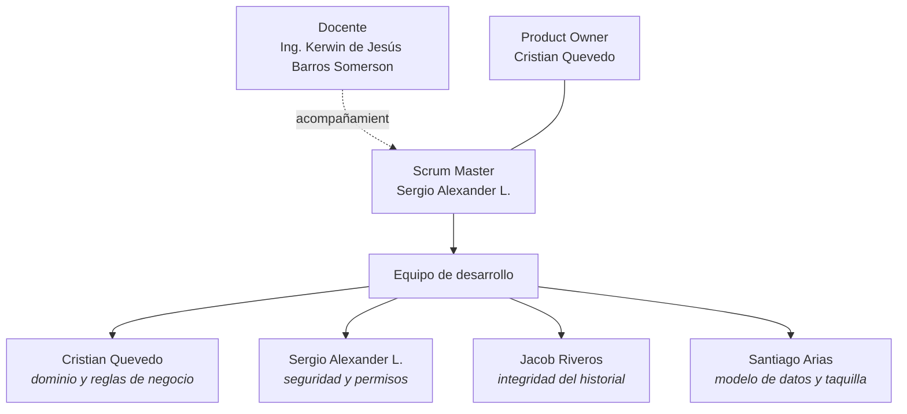

# Organigrama y roles

**Parquivo** · Fundamentos de Ingeniería de Software (12946) · 2026-2

---

## Estructura del equipo

El equipo son cuatro personas, así que **el Product Owner y el Scrum Master
también desarrollan**. Scrum no lo prohíbe y en un equipo de este tamaño lo
contrario dejaría a dos personas escribiendo todo el código.

---

## Roles

### Product Owner — Cristian Quevedo · [@CristianQ8907E](https://github.com/CristianQ8907E)

Responde por **qué se construye y en qué orden**.

- Mantiene el backlog y decide la prioridad de cada historia.
- Es la fuente de verdad del dominio: qué significa cobrar bien, qué es un
  convenio, por qué un movimiento cerrado no se toca.
- Acepta o rechaza cada historia contra sus criterios de aceptación.
- Escribe y mantiene la especificación de requisitos.

### Scrum Master — Sergio Alexander L. · [@Alexander-hub-co](https://github.com/Alexander-hub-co)

Responde por **que el proceso funcione**.

- Administra el repositorio: permisos, hitos, etiquetas y flujo de ramas.
- Convoca y modera la planeación, la revisión y la retrospectiva de cada sprint.
- Retira los impedimentos que frenan al equipo.
- Vigila que el alcance del sprint no cambie a mitad de camino.

### Equipo de desarrollo

Los cuatro. Cada persona tiene además un frente técnico, que no es una frontera
cerrada sino el sitio donde se concentra su trabajo y a quien se le pregunta
primero.

| Persona | Frente técnico | De qué responde |
|---|---|---|
| Cristian Quevedo | Dominio y reglas de negocio | Aislamiento entre establecimientos, registro de entrada, obligatoriedad de la tarifa, supervisión remota |
| Sergio Alexander L. | Seguridad y permisos | Autorización por rol, rechazo de entradas duplicadas, versionado de tarifas, gestión de usuarios |
| Jacob Riveros | Integridad del historial | Login, inmutabilidad de los movimientos cerrados, copia de tarifa y convenio en el cobro, pruebas de acceso |
| Santiago Arias | Modelo de datos y taquilla | Montos en enteros, clasificación por placa, desglose del cobro, pruebas unitarias |

### Docente — Ing. Kerwin de Jesús Barros Somerson · [@kbarrosDev](https://github.com/kbarrosDev)

Acompaña y evalúa. No es parte del equipo de desarrollo ni se le asignan
tareas del backlog.

---

## Matriz de responsabilidad

**R** ejecuta · **A** responde por el resultado · **C** se consulta · **I** se informa

| Actividad | Cristian | Sergio | Jacob | Santiago |
|---|:---:|:---:|:---:|:---:|
| Priorizar el backlog | A | C | C | C |
| Aceptar una historia terminada | A | I | I | I |
| Planear el sprint | C | A | R | R |
| Estimar en puntos | R | R | R | R |
| Administrar el repositorio | I | A | I | I |
| Revisar un *pull request* | R | R | R | R |
| Especificar requisitos | A | C | C | C |
| Diseñar el modelo de datos | C | C | I | A |
| Definir permisos y roles | C | A | I | I |
| Escribir pruebas | C | I | A | R |
| Documentar despliegue y manual | I | I | A | R |
| Retrospectiva | R | A | R | R |

Ninguna actividad tiene dos **A**: siempre hay una sola persona que responde
por el resultado, aunque varias lo ejecuten.

---

## Ceremonias

El equipo se reúne **los martes y los viernes**, cadencia vigente desde el 25 de
agosto de 2026. Los sprints cierran en lunes, de modo que la revisión, la
retrospectiva y la planeación del siguiente caen todas en el martes posterior.

| Ceremonia | Cuándo | Duración | Quiénes | Dónde queda el registro |
|---|---|---|---|---|
| Revisión del sprint | Martes siguiente al cierre | 45 minutos | Los cuatro, con demostración | [`Docs/Review/`](../Review/) |
| Retrospectiva | El mismo martes, tras la revisión | 30 minutos | Los cuatro | [`Docs/Retrospective/`](../Retrospective/) |
| Planeación del sprint | El mismo martes, al final | 1 hora | Los cuatro | [`Docs/Planning/`](../Planning/) |
| Sincronización | Los demás martes y todos los viernes | 15 minutos | Los cuatro | [`Docs/Dailys/`](../Dailys/) |

Las decisiones que no pertenecen a una ceremonia concreta se consignan como
actas en [`Docs/Actas/`](../Actas/).

La sincronización es dos veces por semana y no diaria porque el equipo cursa
otras asignaturas y una reunión diaria que nadie puede sostener se abandona en
la segunda semana. Se prefiere una cadencia que se cumpla, y se fijó en días
concretos —martes y viernes— para que no haya que convocarla cada vez.
