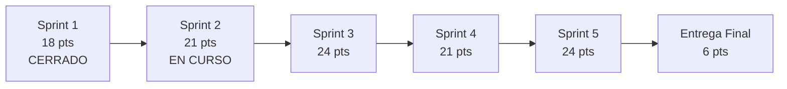

# Reporte gerencial

**Parquivo** · Fundamentos de Ingeniería de Software (12946) · 2026-2
**Corte:** 12 de septiembre de 2026 · Sprint 2 en curso

---

## Resumen

El proyecto va en el segundo de cinco sprints de construcción. La
especificación está completa y cerrada: cinco módulos, 194 requisitos
funcionales, 14 no funcionales y 51 historias de usuario con criterios de
aceptación verificables. El backlog está íntegramente estimado, asignado y
repartido en hitos con fecha.

El riesgo mayor no es técnico sino de calendario: el Sprint 2 cierra en dos días
con sus cuatro historias abiertas.

---

## Avance

| Indicador | Valor |
|---|---|
| Sprints de construcción | 2 de 5 |
| Puntos cerrados | 18 |
| Puntos comprometidos por delante | 96 |
| Historias de usuario especificadas | 51 |
| *Issues* en el tablero sin responsable | 0 |
| Requisitos funcionales | 194 |
| Requisitos no funcionales | 14 |

La velocidad medida es de 18 puntos en el Sprint 1. Los sprints siguientes se
comprometieron entre 21 y 24, un 17 a 33 % por encima de lo único que el equipo
ha demostrado que puede sostener. Es una apuesta consciente: el Sprint 1 fue de
diseño y documentación, más lento por naturaleza que escribir código sobre una
especificación ya cerrada.

---

## Estado por módulo

| Módulo | Historias | Cuándo se construye |
|---|:---:|---|
| M1 · Plataforma y gestión de parqueaderos | 13 | Sprint 2 y Sprint 5 |
| M2 · Configuración del establecimiento | 14 | Sprint 4 |
| M3 · Convenios y descuentos | 6 | Posterior a esta entrega |
| M4 · Taquilla — vehículos | 10 | Sprint 3 y Sprint 4 |
| M5 · Taquilla — bicicletas y fichas | 8 | Posterior a esta entrega |

Los módulos 3 y 5 están especificados pero no programados dentro de los cinco
sprints. Es una decisión de alcance: se prefiere entregar el flujo de cobro de
vehículos terminado y verificado antes que cinco módulos a medias.

---

## Reparto de la carga

| Persona | Rol | Puntos | Participación |
|---|---|:---:|:---:|
| Cristian Quevedo | Product Owner y desarrollo | 27 | 28 % |
| Jacob Riveros | Desarrollo | 24 | 25 % |
| Santiago Arias | Desarrollo | 24 | 25 % |
| Sergio Alexander L. | Scrum Master y desarrollo | 21 | 22 % |

Ningún sprint supera los 24 puntos y las cuatro personas participan en los
cuatro sprints de construcción. La diferencia entre quien más carga y quien
menos es de seis puntos sobre noventa y seis.

---

## Riesgos

| Riesgo | Impacto | Probabilidad | Qué se hace |
|---|---|---|---|
| El Sprint 2 cierra el 14 de septiembre con sus cuatro historias abiertas | Alto | Alta | Lo no terminado pasa al Sprint 3, que sube a 45 puntos y deja de ser alcanzable. Hay que decidir en la revisión qué se recorta, no arrastrarlo entero |
| El motor de cobro se concentra en los sprints 3 y 4 | Alto | Media | Un atraso en el cálculo arrastra dos sprints seguidos. Las tres semanas de la Entrega Final existen justamente para absorberlo |
| Las pruebas están en el Sprint 5, al final | Medio | Media | Un defecto encontrado ahí es el más caro de corregir. Se mitiga con los criterios de aceptación escritos desde ahora en cada historia |
| M2 debe estar antes que el cobro de M4 | Medio | Baja | No se puede cobrar sin tarifa vigente. El Sprint 4 los agrupa a propósito para que la dependencia se resuelva dentro de un mismo sprint |
| La velocidad real puede quedar por debajo de 21 puntos | Medio | Media | Los módulos 3 y 5 quedaron fuera del plan y son el margen: si la velocidad cae, el alcance ya está recortado de antemano |

---

## Decisiones tomadas en este corte

1. **El Sprint 3 se partió en dos.** Tenía 45 puntos, más del doble de la
   velocidad medida. Quedó en 24 con el bloque de entrada, y el bloque de cobro
   pasó completo al Sprint 4.
2. **Las once historias sin responsable quedaron asignadas.** El tablero no
   tiene trabajo huérfano.
3. **La documentación se movió a la Entrega Final.** Documentar el despliegue y
   el manual de usuario mientras todavía se está construyendo produce
   documentos que hay que reescribir.
4. **Cada persona tiene un frente técnico.** No es una frontera cerrada, sino a
   quién se le pregunta primero y quién responde si algo de ese frente falla.

---

## Lo que decide el próximo corte

La revisión del Sprint 2, el 14 de septiembre, es la primera medición real de
velocidad con código de por medio. De ahí sale si el compromiso de 21 a 24
puntos por sprint se sostiene o si hay que bajarlo, y esa decisión gobierna si
los cinco sprints alcanzan para lo comprometido.
