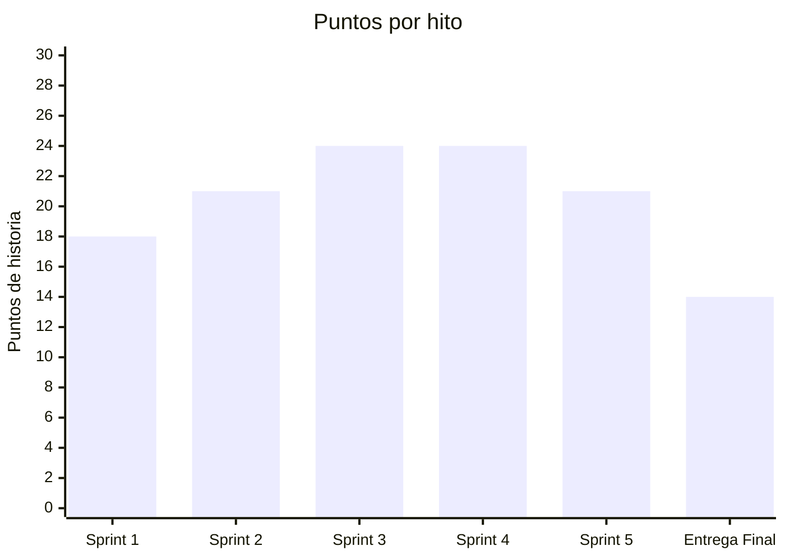
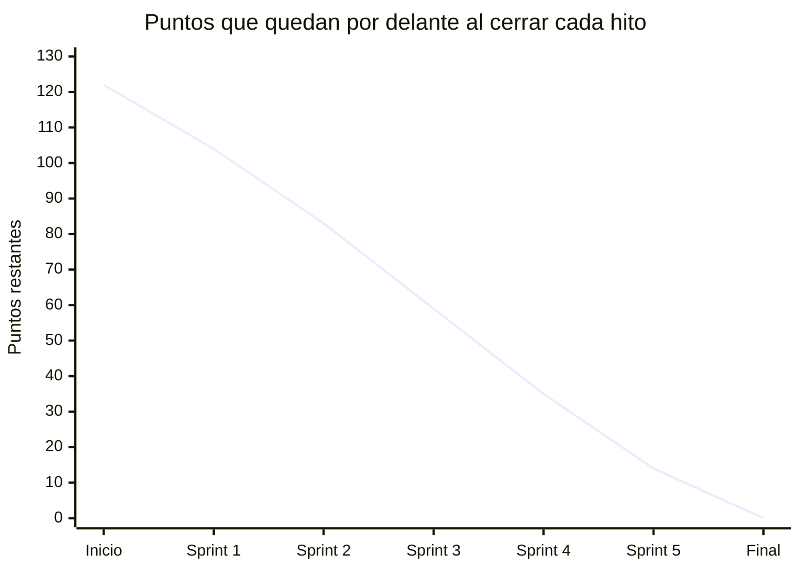
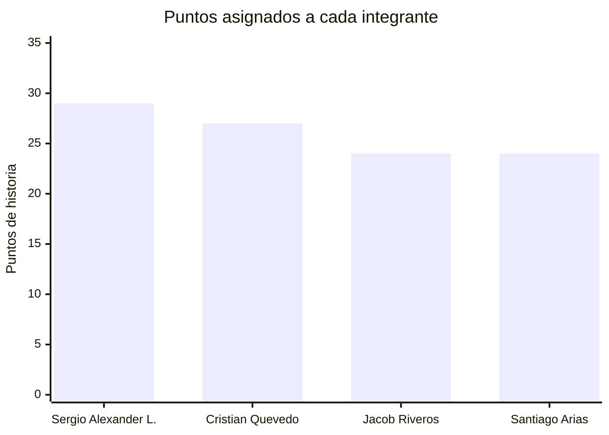
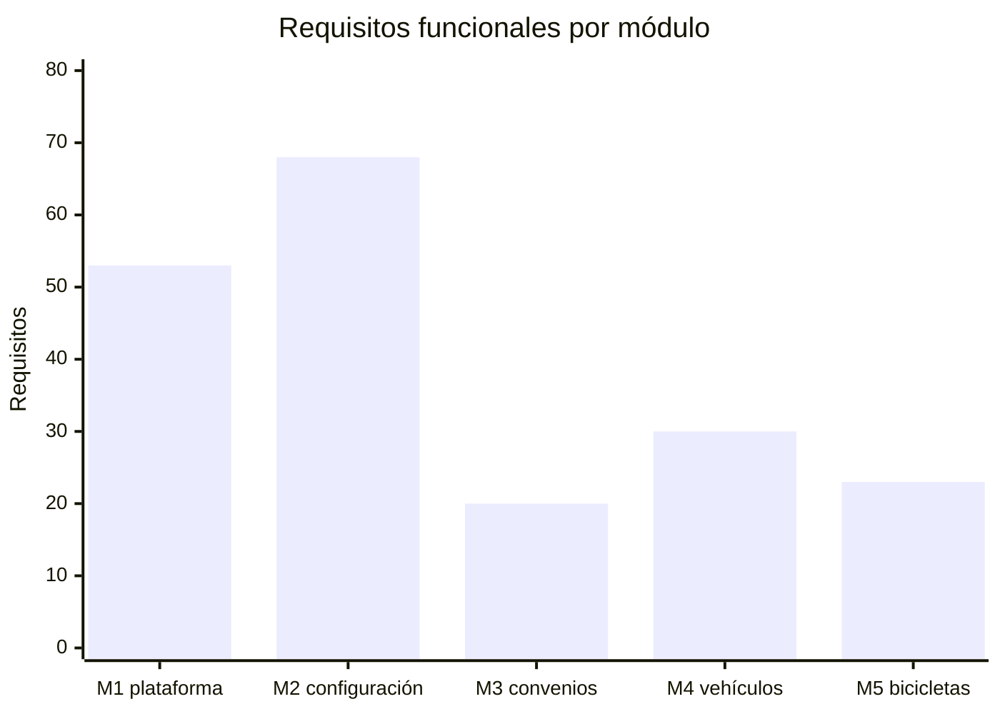

# Gráficas de avance

**Parquivo** · Fundamentos de Ingeniería de Software (12946) · 2026-2
**Corte:** 12 de septiembre de 2026

---

## Puntos comprometidos por hito

El Sprint 1 es el único cerrado: 18 de 18 puntos. Los demás son compromisos.

El tope de 24 puntos no es arbitrario: la única velocidad medida del equipo son
los 18 del Sprint 1, y comprometerse muy por encima de lo que uno ha demostrado
que rinde es la forma más común de acumular atraso.

---

## Trabajo restante

La pendiente es deliberadamente pareja. Un plan con un sprint de 45 puntos y
otro de 9 no se cumple: el sobrecargado arrastra al siguiente y el liviano no
compensa.

---

## Reparto de la carga por persona

Cinco puntos de diferencia entre quien más carga y quien menos, sobre 104. Las
cuatro personas participan en los cuatro sprints de construcción.

---

## Reparto por sprint

| Sprint | Cristian | Sergio | Jacob | Santiago | Total |
|---|:---:|:---:|:---:|:---:|:---:|
| Sprint 2 | 8 | 5 | 5 | 3 | **21** |
| Sprint 3 | 8 | 3 | 5 | 8 | **24** |
| Sprint 4 | 3 | 8 | 8 | 5 | **24** |
| Sprint 5 | 8 | 5 | 3 | 5 | **21** |
| Entrega Final | — | 8 | 3 | 3 | **14** |
| **Total** | **27** | **29** | **24** | **24** | **104** |

---

## Distribución de los requisitos

194 requisitos funcionales y 14 no funcionales. El módulo de configuración es el
más grande porque concentra tarifas, horarios, turnos y cuentas: todo lo que un
establecimiento declara antes de poder cobrar.

---

Las cifras salen del tablero del proyecto y de
[`Docs/SRS/SRS-simplificado.md`](../Docs/SRS/SRS-simplificado.md). Se rehacen en
cada cierre de sprint.
